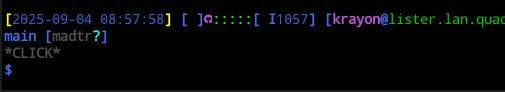
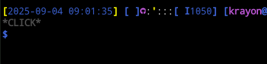
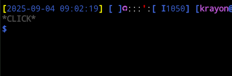
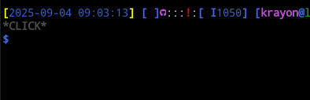
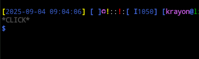
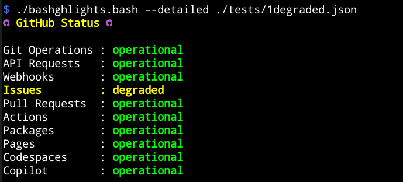

# (Bash) GitHub Lights

----
# Introduction

This project inspired by my colleague's
[GitHubLights for macOS](https://github.com/oskarpie/GitHubLights.git) .  I
don't use macOS and spend most of my time in the terminal so this made more
sense to me.

It is licensed under the GNU GPL version 2. For more information,
see [LICENSE](LICENSE) / [COPYING](COPYING) .

For a list of the main author(s), and other contributors, see
[AUTHORS](AUTHORS.md) and [CONTRIBUTORS](CONTRIBUTORS.md) respectively.

For more information on contributing (new feature, bug fix, pull request etc),
please see [CONTRIBUTING](CONTRIBUTING.md) .

----
# Requirements

At present, all that is required is a `bash` released after late 2006 (19 years
ago), `sed` and `wget` (will make it optionally use `curl` too).

----
# Examples

## PS1 (short mode)

_(Bash) GitHub Lights_ short mode (`-s`/`--short`) is perfect for including is
your prompt (`PS1`) via `PROMPT_COMMAND`. The light positions match that of
GitHubLights for macOS.

_(Bash) GitHub Lights_ will show all green lights under normal circumstances.

  

In the event of a degradation of service(s), one or more yellow single quote
(`'`), comma (`,`) or exclamation marks (`!`) will be displayed depending on
what's degraded.

  

For critical outages, one or more red single quote (`'`), comma (`,`) or
exclamation marks (`!`) will be displayed depending on what the outage is
impacting.

  

  

If more services are impacted, multiple characters and colours will be used to
represent the current state.

  

## Detailed mode

In detailed mode, a summary is listed:

  

----
# Installation

To install, clone the repository, then create a symlink to the bash script in
your `$PATH` somewhere. For example, if you have `bin` in your home directory
set in your path, you can:

```bash
cd "WHERE_I_WANT_TO_CLONE_THE_REPO"/
git clone https://github.com/krayon/bashghlights.git/
cd bashghlights
ln -s $(realpath "ghlights.bash") ~/bin/ghlights
```

Alternatively, you can simply create an alias and add it to your `.bashrc`:

```bash
cd "WHERE_I_WANT_TO_CLONE_THE_REPO"/
git clone https://github.com/krayon/bashghlights.git/
cd bashghlights
echo 'alias ghlights="'"$(realpath "ghlights.bash")"'"' >>~/.bashrc
```

[//]: # ( vim: set ts=4 sw=4 et cindent tw=80 ai si syn=markdown ft=markdown: )
